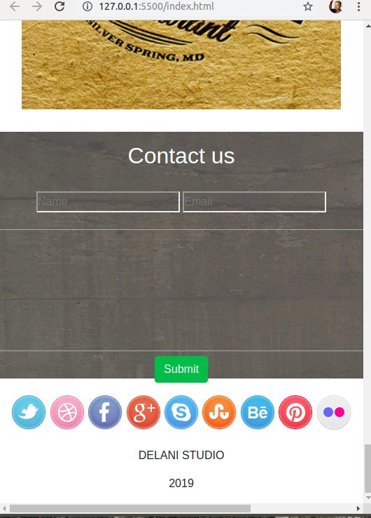

# Delani Studios.

## Author: Maureen Wairimu.

### Description.

### Screenshot.
>
>

### Technologies used.
> HTML
> CSS
> Bootstrap
> jQuery.

### Set-up Instruction.
You can clone the repo at https://github.com/maureen28/Delanistudios.git and open the index.html file using your google Chrome. 
or You can click the live link at 

### BDD
<ul>
<li></li>
<li></li>
<li></li>
</ul>

### Contact Information.
For more information contact us via;
Email:murimimaureen8@gmail.com Tel :+254799280333

MIT License

Copyright (c) 2019 maureen28