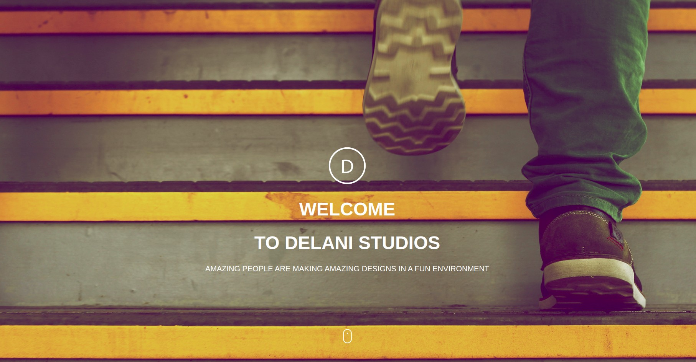
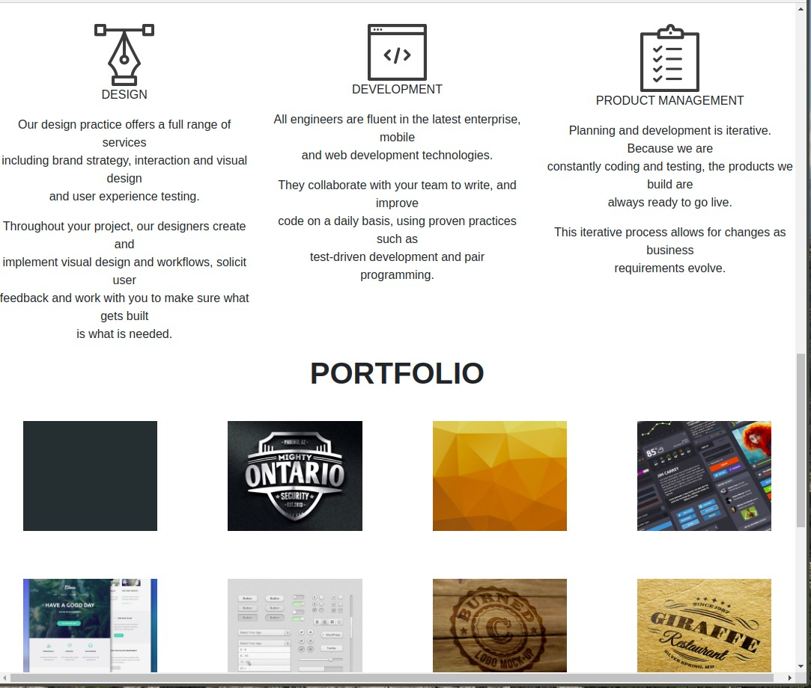

# Delani Studios.

## Author: Maureen Wairimu.

### Description.
This web application is a design studio. They help their users' get to know more about their team and their past projects as well as the services they offer on their webpage.  

### Screenshot.

### Technologies used.
> HTML
> CSS
> Bootstrap
> jQuery.

### Set-up Instruction.
You can clone the repo at https://github.com/maureen28/Delanistudios.git and open the index.html file using your google Chrome. 
or You can click the live link at 

### BDD
<ul>
<li>User enters a valid email which contains "@".</li>
<li>User recieves a pop up message once their messages are delivered</li>
</ul>

### Contact Information.
For more information contact us via;
Email:murimimaureen8@gmail.com Tel :+254799280333

MIT License

Copyright (c) 2019 maureen28